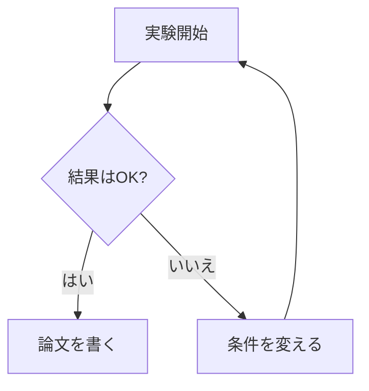

# 第0章 — 5分で試す

ここでは、何もインストールせずに Mermaid を動かしてみます。  
ブラウザで「コードを書く → 図が出る」を体験するのが目的です。

## ステップ 1 — エディタを開く

ブラウザで以下にアクセスしてください。

<https://mermaid.ai/live/>

これは Mermaid 公式が提供している **オンラインエディタ** です。
左側にコードを書くと、右側に図がリアルタイムで表示されます。

!!! warning "「Choose your editor」というダイアログが出たら"
    初回アクセス時に、左に **Mermaid Plus（Recommended）**、右に
    **Open Source** の2択ダイアログが出ることがあります。

    無料で使いたい場合は **右の「Open Source」側** を選んでください
    （`Code only, no login, always free` と書かれている方）。  
    左の Mermaid Plus は AI 機能や共同編集が付く **有料プラン**（無料
    トライアル後は課金）なので、本チュートリアルでは不要です。

    Open Source 側のボタンはどちらでも構いませんが、
    **「Continue to mermaid.ai/live」** が今後の正式 URL です。

!!! note "「ライブエディタ」と書いてあるものは全部同じ仲間"
    Mermaid Live Editor の他にも、GitHub、Notion、Obsidian、VS Code、
    StackEdit、HackMD 等で同じコードがそのまま使えます。  
    このチュートリアルでは、まず Live Editor で文法を覚えてから、
    自分の環境（GitHub やノートアプリ）に持ち込むことを推奨します。

## ステップ 2 — 既存のコードを消して、新しく書く

左側のテキストエリアに最初から入っている例を **すべて削除** してから、
以下を **そのままコピーして貼り付け** てください。

```text
flowchart TD
    A[実験開始] --> B{結果はOK?}
    B -->|はい| C[論文を書く]
    B -->|いいえ| D[条件を変える]
    D --> A
```

右側に次のような図が出れば成功です。



!!! success "今あなたがしたこと"
    たった 5 行で **「実験 → 判断 → 分岐 → ループ」** という意味のある図を
    作りました。これが Mermaid の基本です。

## ステップ 3 — 少しいじってみる

文字を書き換えると、図もすぐ変わります。たとえば `[実験開始]` を `[観測開始]` に
書き換えてみてください。右側の図のラベルも瞬時に変わります。

これが Mermaid の最大の利点です。

- **書き換えやすい** — テキストなので検索置換が効く
- **共有しやすい** — コードをコピーして送るだけ
- **記録しやすい** — Git で履歴を追える

## ステップ 4 — 保存する

Live Editor の右上に **「Save」** や **「Copy URL」** のボタンがあります。  

- **Copy URL** — 図の内容を URL に埋め込んで保存できます。
  URL を友人に送ると、相手も同じ図を編集できます。
- **PNG / SVG** — 画像としてダウンロードできます。Word や PowerPoint に
  貼り付けたいときに便利です。

!!! warning "URL 保存は「URL 自体」が記憶域"
    Live Editor の「Copy URL」は、図の内容をブラウザ上で圧縮して URL に
    埋め込んでいるだけです。サーバには保存されていません。  
    つまり **URL を失うと図も失います**。重要な図はテキストファイルにも
    残しておきましょう。

## まとめ

- Mermaid はインストール不要、ブラウザだけで動く
- 左にコードを書くと、右に図が出る
- 文字を変えると図が変わる

次の章では、Mermaid のコードを読む・書くために必要な **最低限のルール**
（記号の読み方、改行の意味、コードブロックとは何か）を確認します。
Markdown を見たことがない方でも理解できるよう、用語を一つずつ説明します。

→ [第1章 Mermaid の文法ルール](01-basics.md)
