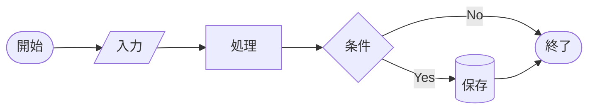

# 第1章 — Mermaid の文法ルール

Markdown という言葉を聞いたことがない方でも理解できるよう、
Mermaid のコードを書くために必要な **共通ルール** を整理します。

## 1.1 コードブロックとは何か

Mermaid のコードは、必ず以下のような **囲い** の中に書きます。

````text
```mermaid
ここに Mermaid のコードを書く
```
````

- 上下の「\`\`\`」（バッククォート 3 つ）は **「ここからここまでがコードですよ」** という印
- 上の「\`\`\`」の直後に書いた `mermaid` は **「この中身は Mermaid で解釈してね」** という指示
- これを **コードブロック** または **フェンスドコードブロック** と呼びます

!!! tip "Mermaid Live Editor では囲いは要らない"
    [Mermaid Live Editor](https://mermaid.ai/live/) は最初から
    「Mermaid を書くエリア」と決まっているので、囲いの \`\`\` は
    書きません。**Mermaid のコードだけ** を書きます。  
    一方、GitHub の README や Notion のページに **直接** Mermaid を
    書く場合は、上のように \`\`\`mermaid 〜 \`\`\` の囲いが必要です。

## 1.2 図の種類は「最初の単語」で決まる

Mermaid のコードは、必ず **最初の行で「どの種類の図を描くか」を宣言** します。

| 最初の行 | 何の図 |
|---|---|
| `flowchart TD` | フローチャート（上から下） |
| `flowchart LR` | フローチャート（左から右） |
| `sequenceDiagram` | シーケンス図 |
| `classDiagram` | クラス図 |
| `stateDiagram-v2` | 状態遷移図 |
| `erDiagram` | ER 図 |
| `gantt` | ガントチャート |
| `pie` | 円グラフ |

たとえば、フローチャートを左→右で描きたければ `flowchart LR`、
ガントチャートなら `gantt` と最初に書きます。

## 1.3 矢印・括弧などの記号

Mermaid では、矢印やノードの形を **記号** で表します。理工系学生にとっては
新しい言語の単語帳のようなものです。最初は表を見ながらで大丈夫です。

### 矢印（フローチャート用）

| コード | 意味 |
|---|---|
| `A --> B` | A から B へ実線矢印 |
| `A --- B` | A と B を実線で結ぶ（矢印なし） |
| `A -.-> B` | 点線の矢印 |
| `A ==> B` | 太い矢印 |
| `A -->|条件| B` | 矢印にラベル「条件」を付ける |

### ノードの形（フローチャート用）

| コード | 形 | 用途 |
|---|---|---|
| `A[テキスト]` | 長方形 | 処理・行動 |
| `A(テキスト)` | 角丸長方形 | 開始・終了 |
| `A{テキスト}` | ひし形 | 判断・分岐 |
| `A((テキスト))` | 円 | 接続点 |
| `A[/テキスト/]` | 平行四辺形 | 入出力 |
| `A[(テキスト)]` | 円柱 | データベース |

実際に並べると、こんな見た目です。



## 1.4 改行とインデントの意味

- **改行で 1 つの命令が終わる** — セミコロンは不要です
- **インデント（行頭の空白）は読みやすさのため** — Mermaid 自体は気にしません
- ただし **インデントを揃えると人間が読みやすくなる** ので、慣れたら整えましょう

```text
flowchart TD
    A --> B
    B --> C
```

上のように 4 スペース下げると見やすいですが、

```text
flowchart TD
A --> B
B --> C
```

のように下げなくても **同じ結果** が得られます。

## 1.5 コメントの書き方

人間向けの注釈を入れたいときは、行の先頭に `%%` を書きます。
Mermaid はこの行を無視します。

```text
flowchart LR
    %% ここは Mermaid に読み飛ばされる行
    A --> B
```

## 1.6 ID とラベルの区別

Mermaid のノードには **ID（識別子）** と **ラベル（表示文字）** があります。

```text
flowchart LR
    a1[実験開始] --> a2[データ取得]
```

- `a1`, `a2` — **ID**。プログラム上の名前。**英数字とアンダースコア** で書く
- `[実験開始]`, `[データ取得]` — **ラベル**。図に表示される文字。**日本語OK**

矢印で参照するときは ID を使います。同じ ID を二度書いてもラベルは
最初に書いたものが優先されます。

!!! warning "ID に日本語を使うと壊れることがある"
    `実験開始 --> データ取得` のように日本語 ID を使うとエラーになる
    バージョンがあります。**ID は英数字・ラベルは日本語** が安全です。

## まとめ

- Mermaid のコードはコードブロック（\`\`\`mermaid 〜 \`\`\`）の中に書く
- 最初の行で図の種類を宣言する
- 矢印やノードの形は記号で表す
- ID は英数字、ラベルは日本語が安全

これで基礎は終わりです。次の章から、具体的な図を一つずつ学びます。

→ [第2章 フローチャート](02-flowchart.md)
