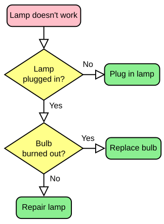
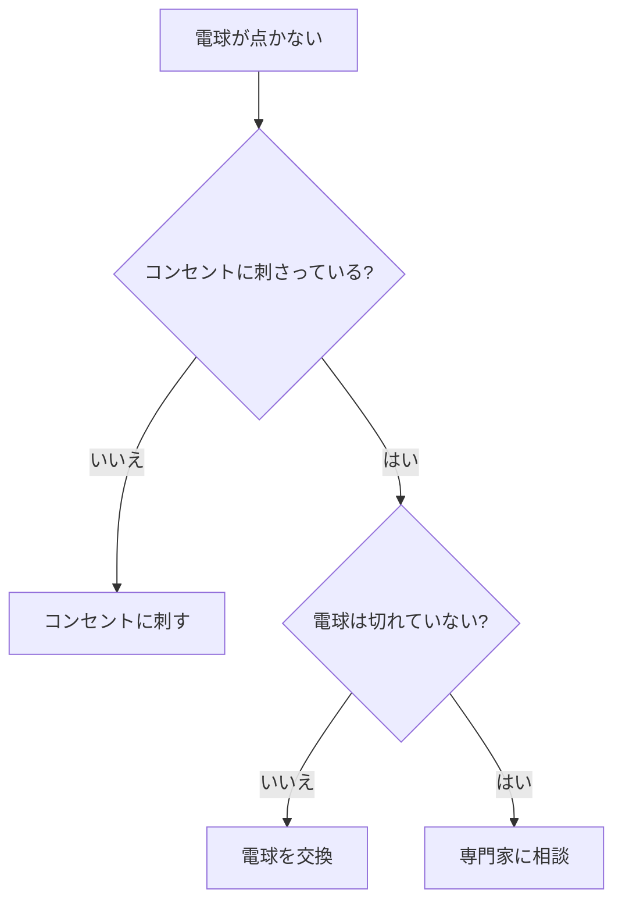
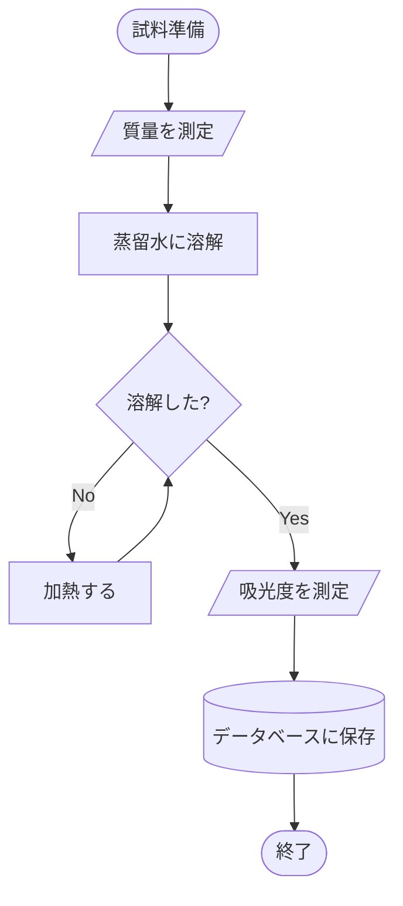
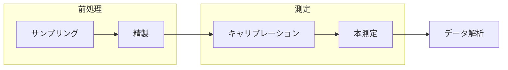

# 第2章 — フローチャート

フローチャートは **「次に何をするか」** を矢印で繋いだ図です。
実験プロトコル、アルゴリズム、トラブルシューティングなど、
理工系のレポートで最も使われる図の一つです。

<figure markdown>
  { width="500" }
  <figcaption>古典的な例：電球がつかないときの判断フロー（出典: Wikimedia Commons, <a href="credits.md">credits</a>）</figcaption>
</figure>

上の図が「紙に書いたフローチャート」だとすると、Mermaid は **同じ図を文字だけで** 再現します。

## 2.1 最小例

```text
flowchart TD
    A[電球が点かない] --> B{コンセントに刺さっている?}
    B -->|いいえ| C[コンセントに刺す]
    B -->|はい| D{電球は切れていない?}
    D -->|いいえ| E[電球を交換]
    D -->|はい| F[専門家に相談]
```



**6 行で書ける** のがフローチャートの強みです。

## 2.2 向き — TD / LR / BT / RL

`flowchart` の後に書く 2 文字で図の向きが決まります。

| コード | 向き |
|---|---|
| `TD` または `TB` | 上から下（Top-Down） |
| `LR` | 左から右（Left-Right） |
| `BT` | 下から上（Bottom-Top） |
| `RL` | 右から左 |

例：左→右


`A --> B --> C --> D` のように **矢印を連ねて書ける** ので便利です。

## 2.3 ノードの形を使い分ける

形そのものに意味を持たせると、図が一目で読めるようになります。
科学的なフロー（実験プロトコル）の典型例：



このコードは次の通りです。

```text
flowchart TD
    Start([試料準備]) --> Weigh[/質量を測定/]
    Weigh --> Dissolve[蒸留水に溶解]
    Dissolve --> Check{溶解した?}
    Check -->|No| Heat[加熱する]
    Heat --> Check
    Check -->|Yes| Measure[/吸光度を測定/]
    Measure --> Save[(データベースに保存)]
    Save --> End([終了])
```

- 開始・終了 → 角丸 `([...])`
- 入出力（測定） → 平行四辺形 `[/.../]`
- 処理 → 長方形 `[...]`
- 判断 → ひし形 `{...}`
- データ保存 → 円柱 `[(...)]`

## 2.4 サブグラフ — グループにまとめる

複雑な工程は **サブグラフ** で囲むと読みやすくなります。

```text
flowchart LR
    subgraph 前処理
        A1[サンプリング] --> A2[精製]
    end
    subgraph 測定
        B1[キャリブレーション] --> B2[本測定]
    end
    A2 --> B1
    B2 --> C[データ解析]
```



`subgraph 名前` から `end` までが 1 つのグループです。研究フェーズの整理、
チーム別の作業範囲、装置別の処理などを表現できます。

## 2.5 スタイル — 色や太さ

特に強調したいノードや矢印には色を付けられます。

```text
flowchart LR
    A[通常処理] --> B[重要な判断]
    B --> C[完了]
    style B fill:#ffd54f,stroke:#f57f17,stroke-width:3px
```


- `fill` — 塗りつぶし色
- `stroke` — 枠線の色
- `stroke-width` — 枠線の太さ

色の指定は CSS と同じです（`#RRGGBB` の 16 進、または `red`, `blue` などの名前）。

## 2.6 練習問題

二分探索（バイナリサーチ）のフローを Mermaid で描いてみましょう。
答えは下の details の中にあります。

??? note "解答例"
    ```mermaid
    flowchart TD
        Start([開始]) --> Init[left=0, right=N-1]
        Init --> Loop{left ≤ right?}
        Loop -->|No| NotFound([見つからない])
        Loop -->|Yes| Mid[mid = left + right の中央]
        Mid --> Cmp{a[mid] と key を比較}
        Cmp -->|等しい| Found([発見])
        Cmp -->|key が小さい| Right[right = mid - 1]
        Cmp -->|key が大きい| Left[left = mid + 1]
        Right --> Loop
        Left --> Loop
    ```

## まとめ

- フローチャートは **矢印で次の処理を繋ぐ** 図
- 向きは `TD`, `LR`, `BT`, `RL`
- ノードの形で意味を分ける（判断はひし形、入出力は平行四辺形 など）
- `subgraph` でフェーズごとにグループ化
- `style` で強調表示できる

→ [第3章 シーケンス図](03-sequence.md)
