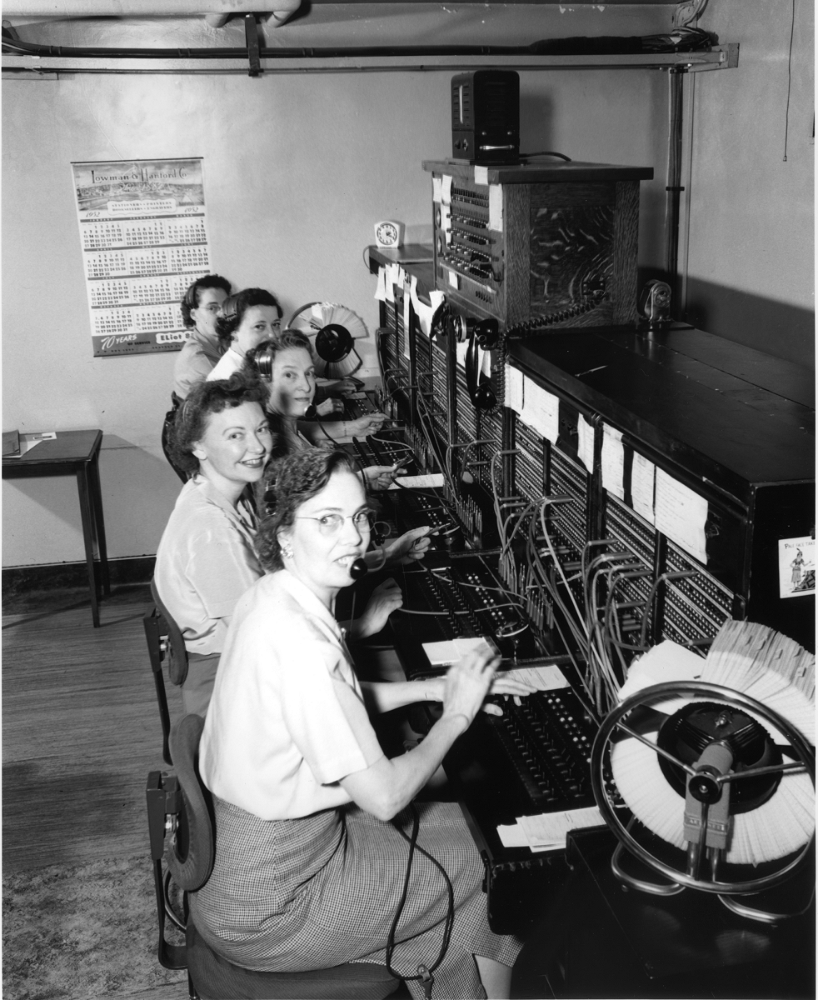
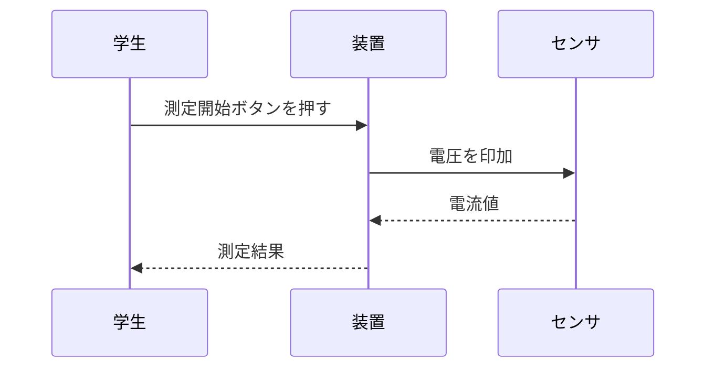
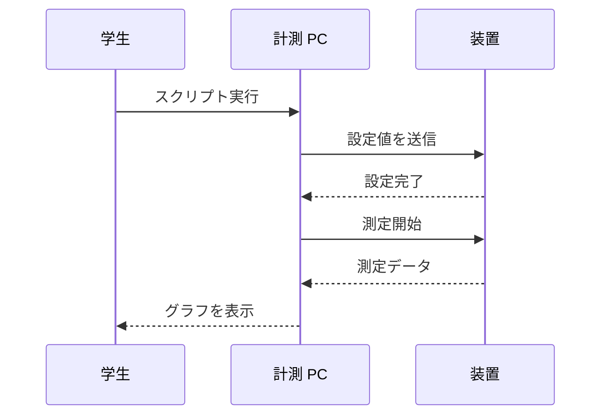
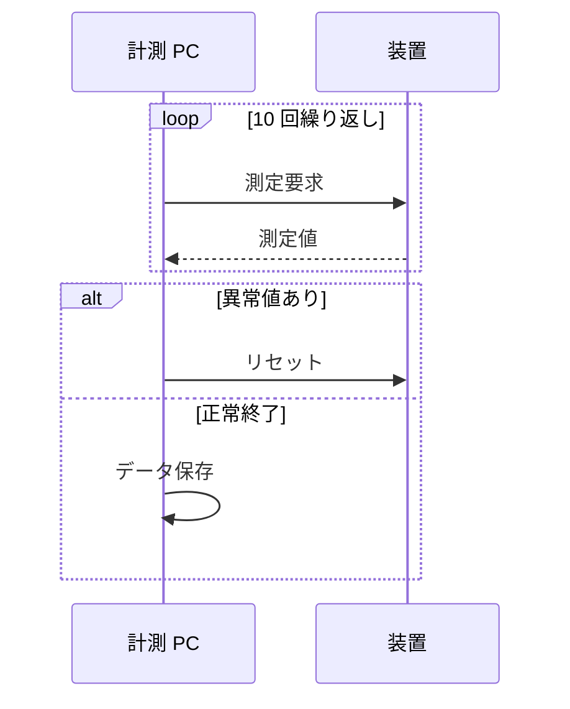
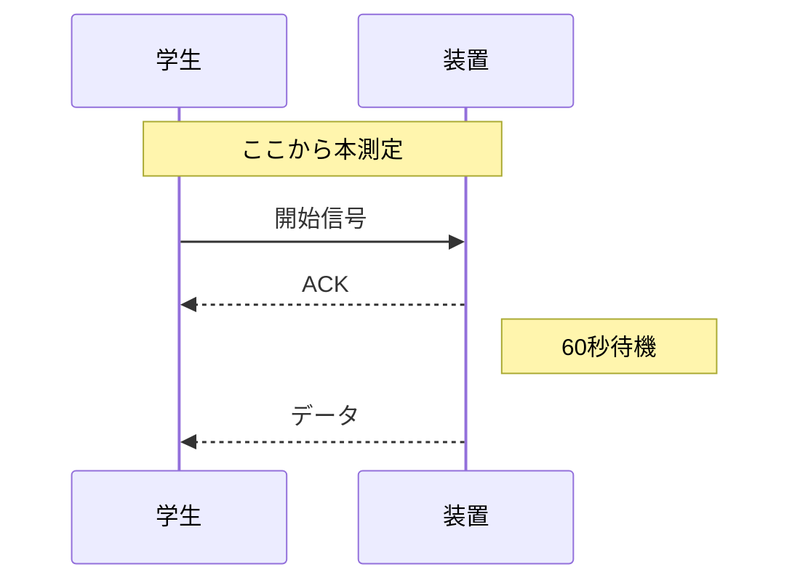
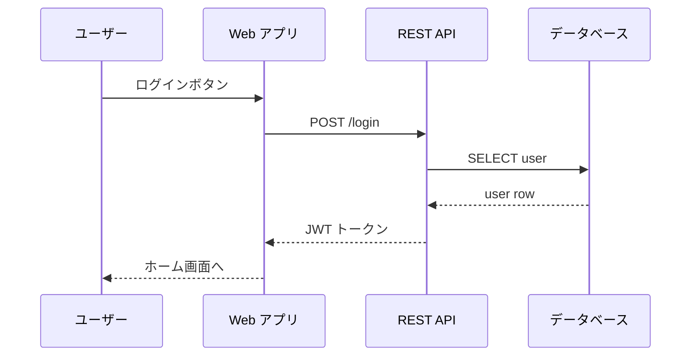

# 第3章 — シーケンス図

シーケンス図は **「誰が、いつ、誰に、何を伝えたか」** を **時間順** に並べた図です。
プロトコルの説明、通信ログの可視化、装置と PC のやり取りなど、
**時間軸が重要なやり取り** を描くのに向いています。

<figure markdown>
  { width="500" }
  <figcaption>シーケンス図のイメージ：電話交換手が回線を繋ぐように、各登場人物のあいだをメッセージが行き交う（出典: Wikimedia Commons）</figcaption>
</figure>

## 3.1 最小例

```text
sequenceDiagram
    学生->>装置: 測定開始ボタンを押す
    装置->>センサ: 電圧を印加
    センサ-->>装置: 電流値
    装置-->>学生: 測定結果
```



- 縦の点線は各登場人物の **時間軸（lifeline）**
- 矢印は **メッセージ** を表し、**上から下に時間が流れる**

## 3.2 矢印の種類

| コード | 意味 |
|---|---|
| `A->>B: msg` | 通常メッセージ（実線矢印） |
| `A-->>B: msg` | 応答メッセージ（点線矢印） |
| `A-)B: msg` | 非同期メッセージ |
| `A-xB: msg` | 失敗・破棄 |

通常は **依頼は実線、返事は点線** で書くのが習わしです。
プログラミングの世界では「リクエスト/レスポンス」と呼びます。

## 3.3 参加者を明示する

最初に `participant` で登場人物を宣言すると、表示順を制御できます。

```text
sequenceDiagram
    participant S as 学生
    participant PC as 計測 PC
    participant D as 装置
    S->>PC: スクリプト実行
    PC->>D: 設定値を送信
    D-->>PC: 設定完了
    PC->>D: 測定開始
    D-->>PC: 測定データ
    PC-->>S: グラフを表示
```



- `participant ID as 表示名` — ID は英数字、表示名は日本語 OK
- 宣言した順に **左から右へ並ぶ**

## 3.4 ループと条件分岐

実験中の繰り返し測定や、エラーリトライなどを表現できます。

```text
sequenceDiagram
    participant PC as 計測 PC
    participant D as 装置
    loop 10 回繰り返し
        PC->>D: 測定要求
        D-->>PC: 測定値
    end
    alt 異常値あり
        PC->>D: リセット
    else 正常終了
        PC->>PC: データ保存
    end
```



- `loop` ... `end` — 繰り返し
- `alt` ... `else` ... `end` — if-else 分岐
- `opt` ... `end` — 任意（条件のときだけ）

`PC->>PC` のように **自分自身宛て** のメッセージも書けます。
これはオブジェクトが内部処理をする様子を表します。

## 3.5 メモを書く

特定のステップに注釈を付けたいときは `Note` を使います。

```text
sequenceDiagram
    participant S as 学生
    participant D as 装置
    Note over S,D: ここから本測定
    S->>D: 開始信号
    D-->>S: ACK
    Note right of D: 60秒待機
    D-->>S: データ
```



- `Note left of X` / `Note right of X` / `Note over X,Y` の 3 種類

## 3.6 ライブラリ呼び出しの図示（CS 寄りの例）

Web API のリクエスト/レスポンスフローもシーケンス図でよく描かれます。



## 3.7 練習問題

PCR（ポリメラーゼ連鎖反応）の 1 サイクルをシーケンス図で描いてみましょう。
登場人物：実験者、サーマルサイクラー、反応管。  
イベント：温度設定 → 加熱 → 反応 → 冷却。

??? note "解答例"
    ```mermaid
    sequenceDiagram
        participant Op as 実験者
        participant TC as サーマルサイクラー
        participant T as 反応管
        Op->>TC: プログラム入力 (95→55→72℃)
        loop 30 サイクル
            TC->>T: 加熱 95℃ (変性)
            T-->>TC: 反応管温度
            TC->>T: 冷却 55℃ (アニーリング)
            T-->>TC: 反応管温度
            TC->>T: 加熱 72℃ (伸長)
            T-->>TC: 反応管温度
        end
        TC-->>Op: 完了通知
    ```

## まとめ

- シーケンス図は **時間順のやり取り** を描く
- 縦線は各登場人物の時間軸
- 実線=依頼、点線=応答
- `loop`, `alt`, `opt` で繰り返しや条件を表現できる
- `Note` で注釈を付けられる

→ [第4章 クラス図](04-class.md)
