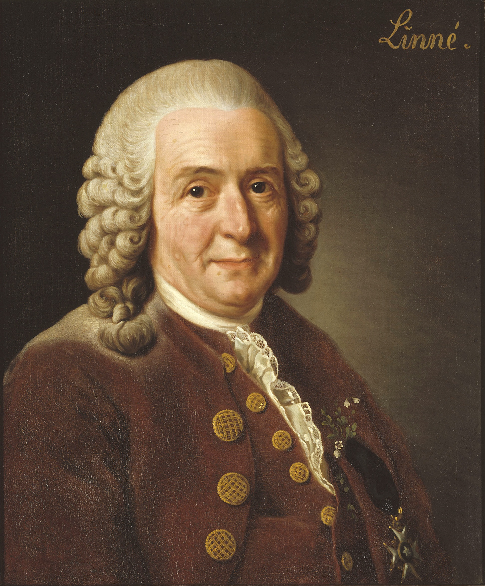
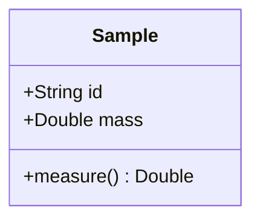
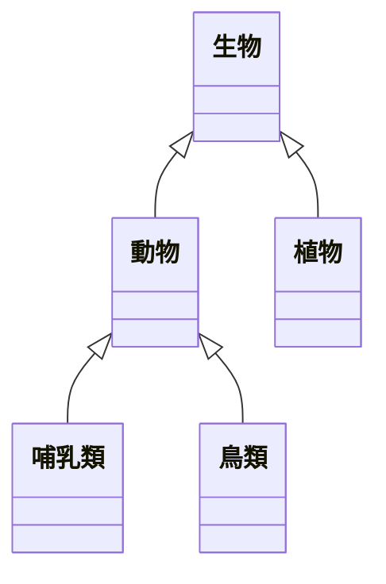
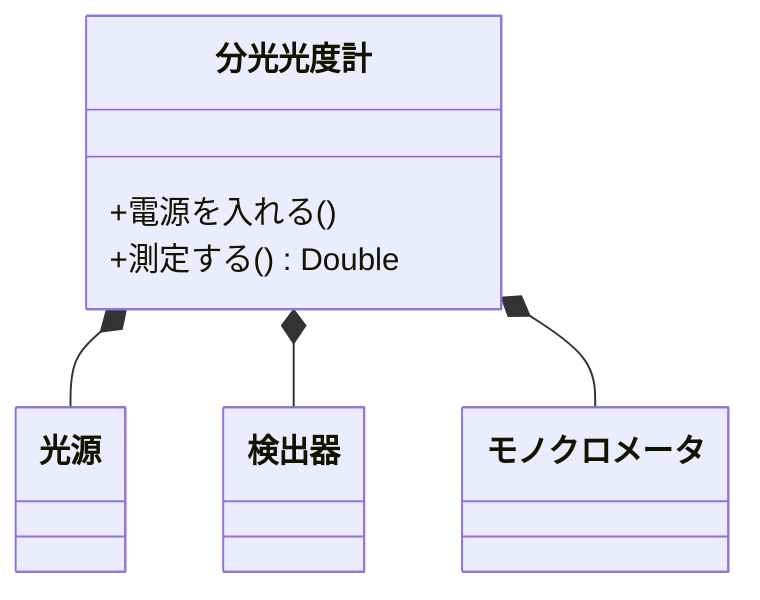
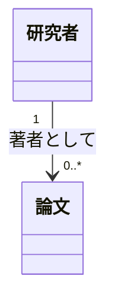
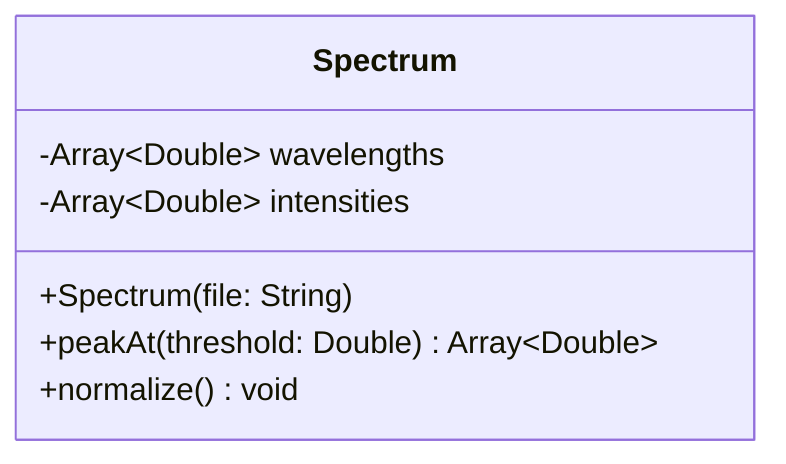
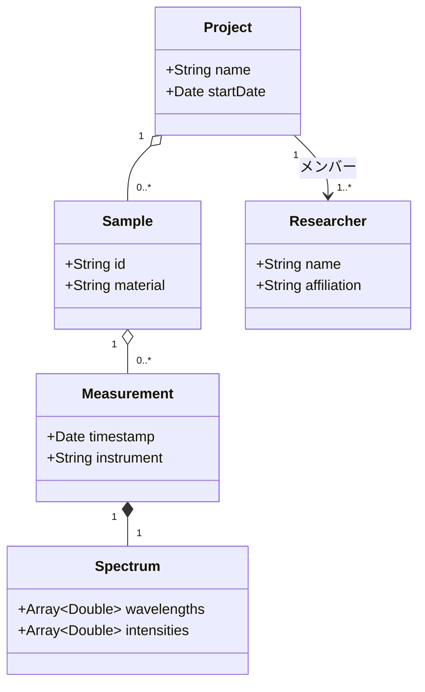

# 第4章 — クラス図

クラス図は **「概念どうしの関係」** を整理する図です。
プログラミングの世界では「オブジェクト指向のクラス設計」に使いますが、
それ以外にも **分類学**、**部品構成（BOM）**、**研究対象のタクソノミー** など、
**カテゴリ間の関係** を表すのに広く使えます。

<figure markdown>
  { width="380" }
  <figcaption>「分類学の父」Carl Linnaeus（1707–1778）。生物を「界・門・綱・目・科・属・種」に階層分けする考え方は、現代のクラス図にも通じる（出典: Wikimedia Commons, Public Domain）</figcaption>
</figure>

## 4.1 最小例 — 1 つのクラスを描く

```text
classDiagram
    class Sample {
        +String id
        +Double mass
        +measure() Double
    }
```



- `class クラス名 { ... }` で 1 つの箱を作る
- 中には **属性（フィールド）** と **メソッド（操作）** を書く
- `+` は public（外から見える）、`-` は private（内部）

## 4.2 関係を描く

複数のクラスをつなぐ「関係線」が、クラス図の本体です。

| コード | 意味 | 読み方 |
|---|---|---|
| `A <|-- B` | 継承 | B は A の一種 |
| `A *-- B` | コンポジション | A は B を「所有」する（B は A 無しでは存在しない） |
| `A o-- B` | 集約 | A は B を「持つ」（B は単独でも存在可） |
| `A --> B` | 関連 | A は B を「参照」する |
| `A -- B` | 関連（無向） | 単に関係がある |

### 継承の例 — 生物の分類



矢印の **塗り三角** が「親」を指します。図を読むときは
「下から上に向かって "は〜の一種である" と読む」と覚えると楽です。

### コンポジションの例 — 装置の部品



`*--` の **塗りひし形** は **「全体側」** を指します。
分光光度計が無くなれば、その光源も検出器も意味を失う、という関係を表します。

## 4.3 多重度（カーディナリティ）

「1 個の親に対して子が何個か」を数字で書けます。

```text
classDiagram
    class 研究者
    class 論文
    研究者 "1" --> "0..*" 論文 : 著者として
```



- `"1"` — 1 個
- `"0..*"` — 0 個以上
- `"1..*"` — 1 個以上
- `"3..5"` — 3〜5 個

矢印の後の `: ラベル` で関係に名前を付けられます。

## 4.4 属性とメソッドの書き方

```text
classDiagram
    class Spectrum {
        -Array~Double~ wavelengths
        -Array~Double~ intensities
        +Spectrum(file: String)
        +peakAt(threshold: Double) Array~Double~
        +normalize() void
    }
```



- 型は `~ ~` でジェネリック（型パラメータ）を書ける
- アクセスは `+` `-` `#`（protected）`~`（package）

## 4.5 大きめの例 — 研究データのモデル

ある分光分析プロジェクトのデータ構造を表してみます。



**読み方のコツ**：1 つの Project は複数の Sample を持ち、
1 つの Sample に対して複数の Measurement が紐づき、
1 つの Measurement は必ず 1 つの Spectrum を含む、と読めます。

これは次の [第6章 ER 図](06-er.md) に似ています。実際、クラス図と ER 図は
表現が近く、どちらを選んでも構いません。

- **コードの設計を伝えたい** → クラス図
- **データベースの構造を伝えたい** → ER 図

## 4.6 練習問題

学生・科目・教員の関係をクラス図で描いてみましょう。

??? note "解答例"
    ```mermaid
    classDiagram
        class 学生 {
            +String 学籍番号
            +String 氏名
        }
        class 科目 {
            +String 科目番号
            +String 科目名
            +Int 単位数
        }
        class 教員 {
            +String 職員番号
            +String 氏名
        }
        学生 "0..*" --> "0..*" 科目 : 履修
        教員 "1" --> "0..*" 科目 : 担当
    ```

## まとめ

- クラス図は **概念・カテゴリ間の関係** を整理する図
- 継承（`<|--`）、コンポジション（`*--`）、集約（`o--`）、関連（`-->`）を使い分ける
- 多重度を数字で添えられる
- 研究データ構造の設計や、生物分類のような階層を描くのにも使える

→ [第5章 状態遷移図](05-state.md)
