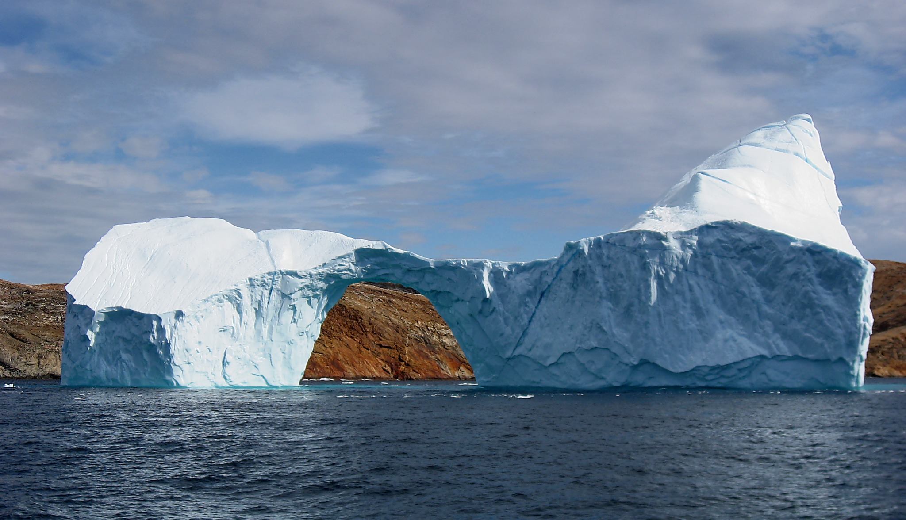
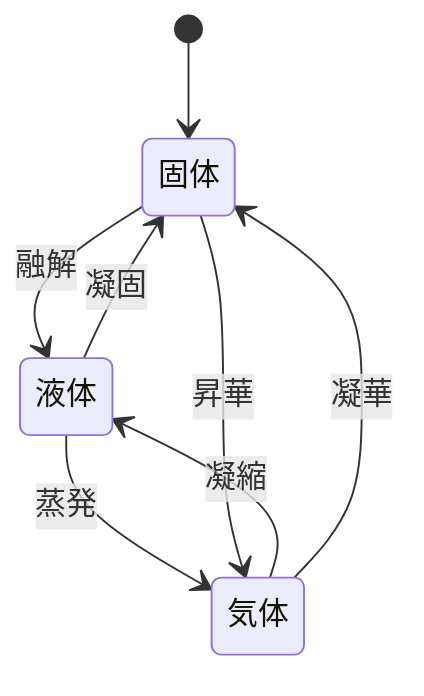
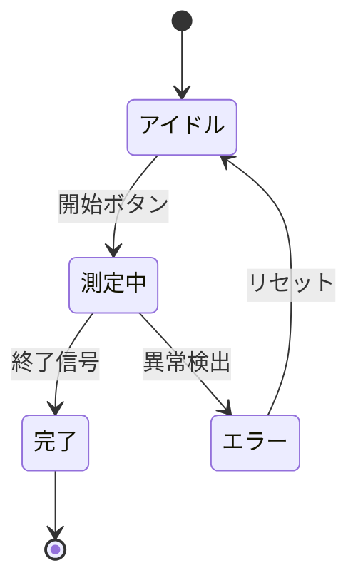
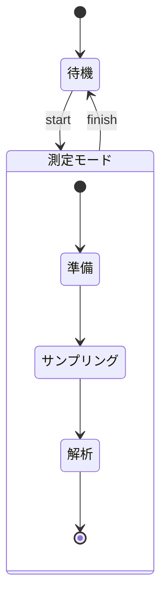
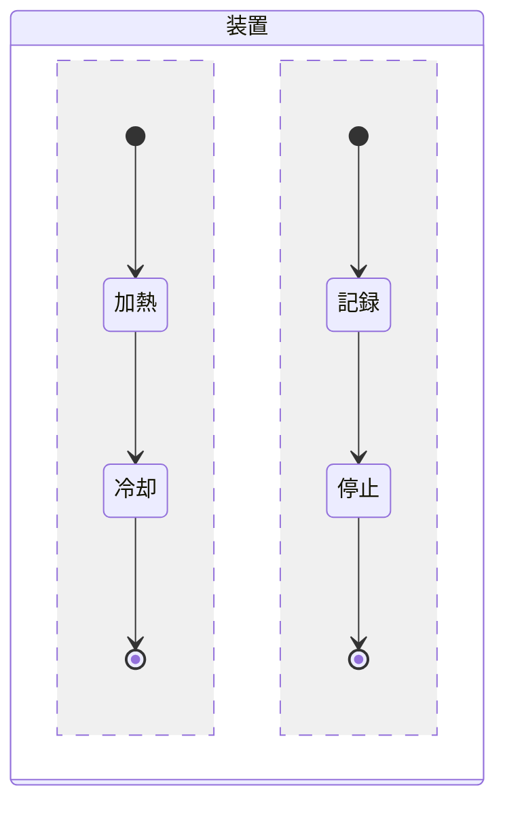
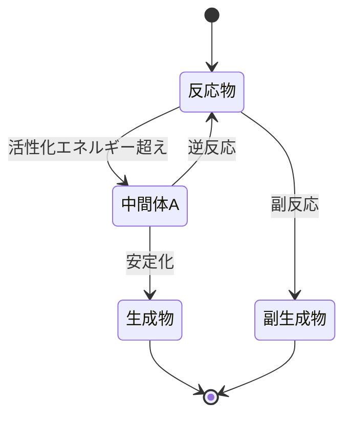

# 第5章 — 状態遷移図

状態遷移図は **「物事がどの状態にあるか、どんな出来事で別の状態に移るか」** を
描く図です。フローチャートとよく似ていますが、フローチャートが **行動の流れ** を
表すのに対し、状態遷移図は **状態の変化** を表します。

<figure markdown>
  { width="500" }
  <figcaption>水の三態：固体（氷）→ 液体（水）→ 気体（水蒸気）。温度や圧力という「出来事」が、状態を切り替える（出典: Wikimedia Commons, CC BY-SA）</figcaption>
</figure>

水の状態変化、化学反応の中間状態、ユーザーインターフェースの画面遷移、
通信プロトコルのステートマシンなど、用途はとても広いです。

## 5.1 最小例 — 水の三態

```text
stateDiagram-v2
    [*] --> 固体
    固体 --> 液体 : 融解
    液体 --> 固体 : 凝固
    液体 --> 気体 : 蒸発
    気体 --> 液体 : 凝縮
    固体 --> 気体 : 昇華
    気体 --> 固体 : 凝華
```



- `stateDiagram-v2` で開始（**`-v2` を忘れない** — 旧版は表現力が低い）
- `[*]` は **開始状態** または **終了状態**
- `状態A --> 状態B : ラベル` で遷移を書く

!!! note "ラベルは「出来事（イベント）」を書く"
    遷移ラベルには「**何が起こったから状態が変わったのか**」を書きます。  
    水なら「融解」「凝固」など、ソフトウェアなら「ボタン押下」「タイムアウト」など。

## 5.2 終了状態と分岐

`[*]` は文脈で意味が変わります。

- `[*] --> 状態X` → 状態 X が **開始状態**
- `状態Y --> [*]` → 状態 Y は **終了状態**

```text
stateDiagram-v2
    [*] --> アイドル
    アイドル --> 測定中 : 開始ボタン
    測定中 --> 完了 : 終了信号
    測定中 --> エラー : 異常検出
    エラー --> アイドル : リセット
    完了 --> [*]
```



これは典型的な **測定装置のステートマシン** です。
複数の遷移条件があっても、図にすると一目で把握できます。

## 5.3 複合状態（状態の中に状態を入れる）

複雑なシステムでは、状態の中にさらに細かい状態があります。

```text
stateDiagram-v2
    [*] --> 待機
    待機 --> 測定モード : start
    state 測定モード {
        [*] --> 準備
        準備 --> サンプリング
        サンプリング --> 解析
        解析 --> [*]
    }
    測定モード --> 待機 : finish
```



`state 名前 { ... }` で **入れ子の状態** が書けます。中の `[*]` は、
その複合状態の中での開始・終了を表します。

## 5.4 並行状態（同時に複数の状態を持つ）

`--` で区切ると、**同時並行で進む状態** を表せます。

```text
stateDiagram-v2
    state 装置 {
        [*] --> 加熱
        加熱 --> 冷却
        冷却 --> [*]
        --
        [*] --> 記録
        記録 --> 停止
        停止 --> [*]
    }
```



たとえば「装置は加熱⇄冷却を繰り返しつつ、同時にログ記録も並行して行う」
ような場面に使います。

## 5.5 化学反応の例

ある反応で、中間体を経由して生成物に至る経路を状態遷移で表現できます。



## 5.6 練習問題

スマートフォンの状態を状態遷移図で表してみましょう。状態：電源OFF、起動中、
ホーム画面、アプリ起動中、スリープ。イベント：電源ボタン、ホームボタン、
アプリタップ。

??? note "解答例"
    ```mermaid
    stateDiagram-v2
        [*] --> 電源OFF
        電源OFF --> 起動中 : 電源ボタン長押し
        起動中 --> ホーム画面 : 起動完了
        ホーム画面 --> アプリ起動中 : アプリタップ
        アプリ起動中 --> ホーム画面 : ホームボタン
        ホーム画面 --> スリープ : 電源ボタン短押し
        スリープ --> ホーム画面 : 電源ボタン短押し
        スリープ --> 電源OFF : 電源ボタン長押し
    ```

## まとめ

- 状態遷移図は **状態の変化** を描く（≠ 行動の流れ）
- `stateDiagram-v2` で始める
- `[*]` は開始・終了状態
- ラベルには **出来事** を書く
- 複合状態や並行状態も表現できる

→ [第6章 ER 図](06-er.md)
