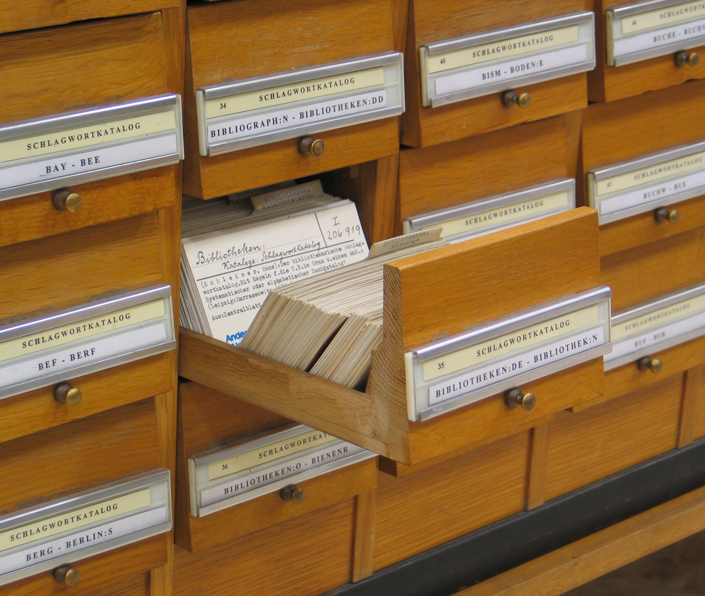
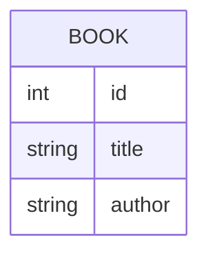
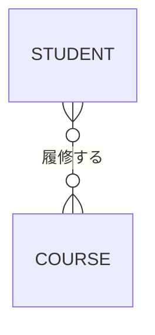
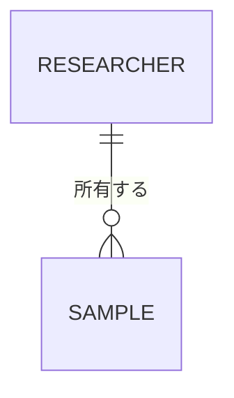
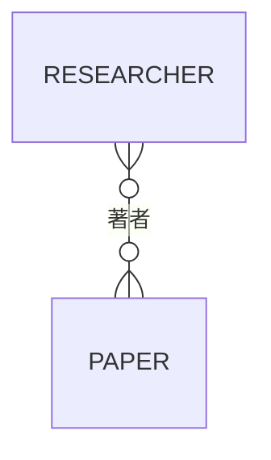
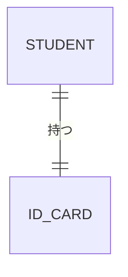
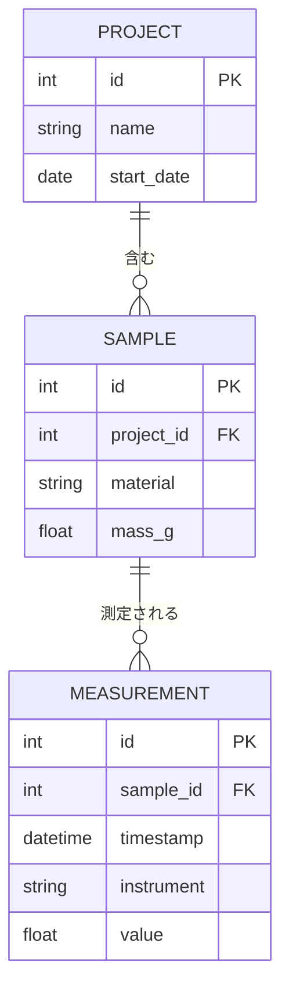

# 第6章 — ER 図（実体関連図）

ER 図（Entity-Relationship Diagram）は **データの構造** を表す図です。
研究データの整理、データベース設計、実験ログの管理などで使います。

<figure markdown>
  { width="500" }
  <figcaption>かつての図書館の目録カード。1 枚 1 枚が「本」という実体（entity）の属性を記録している。ER 図はこれをデジタル化するための設計図（出典: Wikimedia Commons）</figcaption>
</figure>

## 6.1 最小例

```text
erDiagram
    BOOK {
        int id
        string title
        string author
    }
```



これは「`BOOK` という実体には `id`, `title`, `author` という属性がある」と読みます。
属性の左に書くのは **データ型**（int, string, date など）です。

!!! note "実体名は大文字慣習"
    ER 図の実体名は **`BOOK`, `STUDENT`** のように大文字で書くのが慣習です。
    Mermaid 内では小文字でも動きますが、英大文字にしておくと一目で
    「ER の実体」と分かります。

## 6.2 リレーションシップ（関係）

実体どうしの関係は、両端の **記法（多重度）** で表します。

| 記号 | 意味 |
|---|---|
| `||` | ちょうど 1 個 |
| `o|` | 0 または 1 個 |
| `|{` | 1 個以上 |
| `o{` | 0 個以上 |

たとえば「学生は複数の科目を履修する、科目は複数の学生が履修する」なら：

```text
erDiagram
    STUDENT }o--o{ COURSE : 履修する
```



- `}o` → 左側は 0 個以上（学生は 0 〜 多くの科目を取る）
- `o{` → 右側は 0 個以上（科目は 0 〜 多くの学生に履修される）
- `: ラベル` で関係に名前を付ける

## 6.3 関係の種類を読み解く

よく出てくる 3 パターンを覚えれば十分です。

### 1 対 多

「1 人の研究者が複数のサンプルを持つ、サンプルは必ず 1 人の研究者に属する」

```text
erDiagram
    RESEARCHER ||--o{ SAMPLE : 所有する
```



### 多 対 多

「論文は複数の著者を持ち、研究者は複数の論文を書く」

```text
erDiagram
    RESEARCHER }o--o{ PAPER : 著者
```



### 1 対 1

「学生は 1 つの学生証を持つ」

```text
erDiagram
    STUDENT ||--|| ID_CARD : 持つ
```



## 6.4 属性に主キー・外部キーをマークする

データベース設計に使う場合、`PK`（主キー）と `FK`（外部キー）を属性の末尾に
付けて表記できます。

```text
erDiagram
    PROJECT {
        int id PK
        string name
        date start_date
    }
    SAMPLE {
        int id PK
        int project_id FK
        string material
        float mass_g
    }
    MEASUREMENT {
        int id PK
        int sample_id FK
        datetime timestamp
        string instrument
        float value
    }
    PROJECT ||--o{ SAMPLE : 含む
    SAMPLE ||--o{ MEASUREMENT : 測定される
```



これは実験データを **SQLite や PostgreSQL** で管理するときの、ほぼそのままの
設計図になります。Mermaid で書いておけば、研究室のメンバーとの共有や、
将来のスキーマ変更時の議論がぐっとスムーズになります。

## 6.5 ER 図とクラス図の使い分け

似た図ですが、目的が異なります。

| 観点 | クラス図 | ER 図 |
|---|---|---|
| 主目的 | コードの設計 | データ保管の設計 |
| 「動作」を書くか | 書く（メソッド） | 書かない |
| 多重度 | 関係線の脇に文字 | 関係線の端の記号 |
| 継承 | あり | 通常なし |

研究データの構造を **そのままデータベースに落とし込みたい** ときは ER 図、
**プログラム上のオブジェクトとして扱いたい** ときはクラス図を選びます。

## 6.6 練習問題

ある図書館の所蔵管理を ER 図で描いてみましょう。実体：本、著者、出版社、貸出記録、利用者。

??? note "解答例"
    ```mermaid
    erDiagram
        AUTHOR {
            int id PK
            string name
        }
        PUBLISHER {
            int id PK
            string name
        }
        BOOK {
            int id PK
            string title
            int publisher_id FK
            string isbn
        }
        USER {
            int id PK
            string name
        }
        LOAN {
            int id PK
            int book_id FK
            int user_id FK
            date loaned_at
            date due_at
        }
        BOOK }o--o{ AUTHOR : 著者
        BOOK }o--|| PUBLISHER : 出版
        BOOK ||--o{ LOAN : 貸出履歴
        USER ||--o{ LOAN : 借りる
    ```

## まとめ

- ER 図は **データの構造** を表す図
- 実体（箱）には属性を書き、関係（線）で繋ぐ
- 両端の記号（`||`, `o|`, `|{`, `o{`）で多重度を表現
- 主キー（`PK`）と外部キー（`FK`）を付けるとそのまま DB 設計に使える

→ [第7章 ガントチャート](07-gantt.md)
