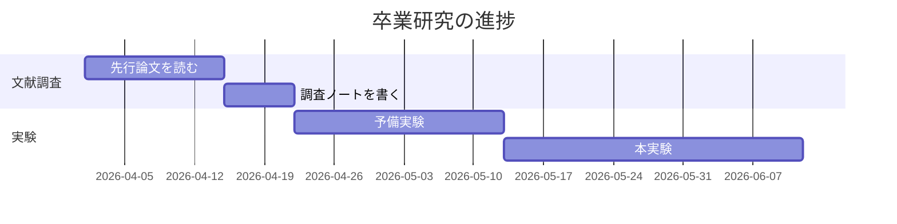
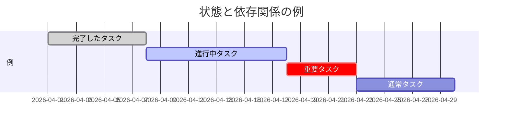
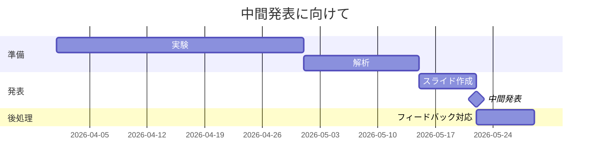
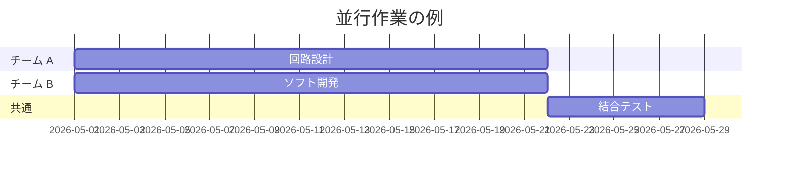
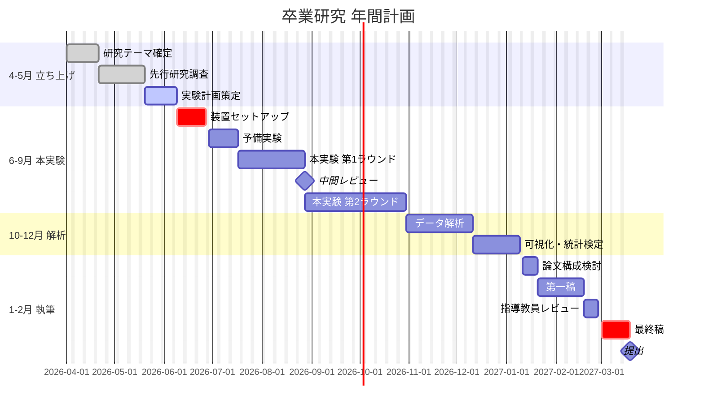

# 第7章 — ガントチャート

ガントチャートは **タスクを横棒で並べたスケジュール表** です。
卒業研究、輪講、グループ課題、共同研究プロジェクトなど、
**期間と依存関係を持つ作業の計画** に最適です。

<figure markdown>
  { width="280" }
  <figcaption>Henry Laurence Gantt（1861–1919）。経営工学者。20 世紀初頭にこの図を考案し、現在も世界中のプロジェクト管理で使われている（出典: Wikimedia Commons, Public Domain）</figcaption>
</figure>

## 7.1 最小例

```text
gantt
    title 卒業研究の進捗
    dateFormat YYYY-MM-DD
    section 文献調査
    先行論文を読む       :a1, 2026-04-01, 14d
    調査ノートを書く     :a2, after a1, 7d
    section 実験
    予備実験             :b1, 2026-04-22, 21d
    本実験               :b2, after b1, 30d
```



- `title` でタイトル
- `dateFormat` で日付の書式（`YYYY-MM-DD` が標準）
- `section` でフェーズ（縦に区切る帯）
- 各タスクは `タスク名 :ID, 開始日, 期間`

## 7.2 タスクの書き方

書式の組み合わせは以下の通りです。

```text
タスク名 :id, 開始日, 期間
タスク名 :id, 開始日, 終了日
タスク名 :id, after 別のID, 期間
タスク名 :状態, id, 開始日, 期間
```

- **期間** は `14d`（14日）、`2w`（2週間）、`3h`（3時間）
- **開始日** は具体的な日付、または `after 別のID`
- **状態** は `done`（完了）、`active`（進行中）、`crit`（重要・赤色）

```text
gantt
    title 状態と依存関係の例
    dateFormat YYYY-MM-DD
    section 例
    完了したタスク       :done, t1, 2026-04-01, 7d
    進行中タスク         :active, t2, after t1, 10d
    重要タスク           :crit, t3, after t2, 5d
    通常タスク           :t4, after t3, 7d
```



- **濃いグレー** = `done`
- **青系で塗りつぶし** = `active`
- **赤系** = `crit`（critical path）
- **薄色の枠** = 状態なし（予定）

## 7.3 マイルストーン

中間発表や提出など、**期間ゼロの目印** はマイルストーンで表します。

```text
gantt
    title 中間発表に向けて
    dateFormat YYYY-MM-DD
    section 準備
    実験           :a1, 2026-04-01, 30d
    解析           :a2, after a1, 14d
    section 発表
    スライド作成   :b1, after a2, 7d
    中間発表       :milestone, m1, after b1, 0d
    section 後処理
    フィードバック対応 :c1, after m1, 7d
```



`:milestone` を付け、期間を `0d` にすると ◆ 印で表示されます。

## 7.4 並行タスク

同じセクションで複数の作業を並行できます。`after` を使わず別々に開始日を指定すれば
時間軸上で重なって表示されます。

```text
gantt
    title 並行作業の例
    dateFormat YYYY-MM-DD
    section チーム A
    回路設計     :a1, 2026-05-01, 21d
    section チーム B
    ソフト開発   :b1, 2026-05-01, 21d
    section 共通
    結合テスト   :c1, after a1 b1, 7d
```



`after a1 b1` のように **複数の ID をスペース区切り** で書くと、
両方が終わってから始まるタスクになります（合流ポイント）。

## 7.5 卒業研究の年間計画 — 大きめの例

理工系学生にとって最も実用的な使い方の一つです。



`excludes weekends` を入れると **土日を除いた営業日ベース** でスケジュールが
計算されます。`excludes 2026-05-03, 2026-05-04` のように **特定日を除外** する
こともできます。

## 7.6 練習問題

3 週間の輪講（毎週 1 回、3 人発表）と、最終週のディスカッションを
ガントチャートにしてみましょう。

??? note "解答例"
    ```mermaid
    gantt
        title 輪講スケジュール
        dateFormat YYYY-MM-DD
        section 発表者 A
        Aの準備     :a1, 2026-06-01, 7d
        Aの発表     :milestone, ma, after a1, 0d
        section 発表者 B
        Bの準備     :b1, 2026-06-08, 7d
        Bの発表     :milestone, mb, after b1, 0d
        section 発表者 C
        Cの準備     :c1, 2026-06-15, 7d
        Cの発表     :milestone, mc, after c1, 0d
        section まとめ
        全体ディスカッション :crit, d1, after mc, 3d
    ```

## まとめ

- ガントチャートは **タスクを横棒で並べた予定表**
- `gantt` で始め、`dateFormat`, `title`, `section` を使う
- 各タスクは `タスク名 :id, 開始, 期間` で書く
- `after id` で前のタスクの終了を起点にできる
- `done`, `active`, `crit`, `milestone` で見せ方を変える

→ [付録A チートシート](08-cheatsheet.md)
