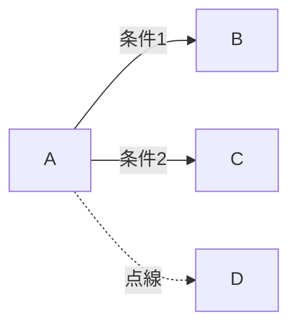
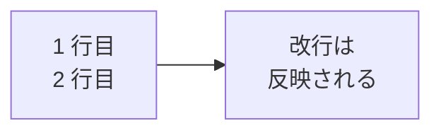
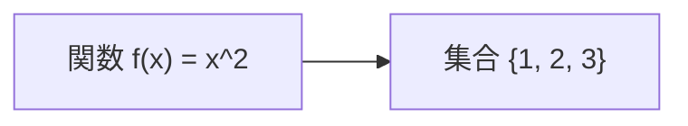
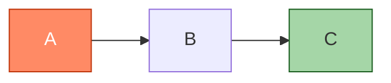

# 付録B — つまずきポイント FAQ

書いていてハマりがちなポイントと対処法を集めました。

## Q1. 描画が出ない（空白のままになる）

**症状**：Live Editor で「Syntax error in graph」が出る、もしくは図が真っ白。

主な原因と対処：

1. **最初の行を忘れている**  
   `flowchart TD` や `sequenceDiagram` で始めてください。

2. **記号が全角になっている**  
   `-->` が `ー＞` になっていないかチェック。日本語入力モードの誤変換が多発します。

3. **括弧の対応が合っていない**  
   `A[テキスト` のように閉じ括弧を忘れていませんか。

4. **`stateDiagram` と書いている**  
   `stateDiagram-v2` でないと旧版になり、複合状態などが描画できません。

## Q2. 日本語ラベルが文字化けする

通常はそのまま日本語が使えますが、ごく古いバージョンの Mermaid では問題が出ます。

- **ID は英数字に変える** — `実験開始` ではなく `start` などに
- ラベル（`[ ]` の中）は日本語で OK
- それでも崩れる場合は、半角の `"..."` で囲んでみる：`A["観察 → 仮説"]`

## Q3. 矢印にラベルを付けたい

3 通りの書き方ができます。お好みでどうぞ。

```text
flowchart LR
    A -->|条件1| B
    A -- 条件2 --> C
    A -.->|点線| D
```



## Q4. ノードを横並びにしたい

`flowchart TD`（上から下）だと縦に並びます。横に並べたいときは `flowchart LR`（左から右）に変えるのが基本。  
一部だけ横並びにしたいときはサブグラフを使います。

```mermaid
flowchart TD
    Start --> Branch
    subgraph 横並び [direction LR]
        direction LR
        B1 --> B2 --> B3
    end
    Branch --> 横並び
    横並び --> End
```

## Q5. 改行をラベルに入れたい

`<br>` または `\n` でラベル内改行できます。

```text
flowchart LR
    A[1 行目<br>2 行目] --> B["改行は\n反映される"]
```



`\n` を使う場合は `"..."` で囲むのが安全です。

## Q6. ラベルに記号（`(` `)` `[` `]` `{` `}` など）を入れたい

`"..."` で囲むとほとんどの記号が使えます。

```text
flowchart LR
    A["関数 f(x) = x^2"] --> B["集合 {1, 2, 3}"]
```



## Q7. 図が大きすぎてはみ出る

- Live Editor では右上のズームや「Fit」を使う
- HTML で表示する場合は CSS で `max-width: 100%; height: auto;`
- PNG 書き出しで「Width」を指定して小さく出す

## Q8. 図に色を付けたい

`style` で個別ノードに色を付けるか、`classDef` でクラス的にまとめます。

```text
flowchart LR
    A:::important --> B --> C:::done
    classDef important fill:#ff8a65,stroke:#bf360c,color:white
    classDef done fill:#a5d6a7,stroke:#1b5e20
```



## Q9. GitHub の README で図が出ない

- ファイル拡張子が `.md` であること
- コードフェンスが \`\`\`mermaid で始まっていること
- GitHub の通常 Markdown ビューでは 2022 年以降 Mermaid をサポート済み
- GitHub Pages（Jekyll 既定）では別途プラグインが必要

GitHub Pages で見たい場合は、本サイトのように **MkDocs + Material** を使う方が
お手軽です。

## Q10. レポートの図として印刷したい

Live Editor 右上の **「Actions → PNG」** または **「SVG」** で保存できます。

- **PNG** — Word や PowerPoint に貼り付けやすい
- **SVG** — 拡大しても劣化しない、LaTeX に取り込める
- **PDF** — `mermaid-cli`（`mmdc`）コマンドで生成可能：
  ```bash
  npx -p @mermaid-js/mermaid-cli mmdc -i input.mmd -o output.pdf
  ```

## Q11. 数式を入れたい

Mermaid 自体には数式機能はありません。図に数式を入れたい場合は：

1. ラベルとして「`y = a*x + b`」のような **テキスト表記** にする
2. 別途、ラベル位置に LaTeX/KaTeX で重ねる（高度）
3. 数式は別ファイル（KaTeX, MathJax）で書き、図と並べる

## Q12. クラス図でメソッドの引数の型がおかしくなる

`型~T~` のように `~ ~` で囲むとジェネリック型として解釈されます。  
コンマや角括弧をラベルに入れたい場合は `"..."` で囲んでください。

## Q13. ガントチャートの日付が変

- `dateFormat` を忘れていませんか？ 通常 `YYYY-MM-DD` を指定
- `excludes weekends` を入れると土日が飛ばされて期間が伸びることがあります
- `2d` などの期間指定は「**営業日**」になります（excludes 設定時）

## それでも解決しないとき

- 公式ドキュメント: <https://mermaid.js.org/>
- GitHub Issues: <https://github.com/mermaid-js/mermaid/issues>
- Live Editor のエラーメッセージは結構詳しい — まずそれを読む

---

← [付録A チートシート](08-cheatsheet.md) に戻る
