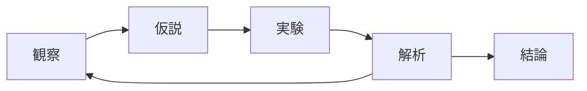

# はじめに — Mermaid という「文字で図を描く道具」

このチュートリアルは、理工系の大学生が **Mermaid** を使ってフローチャートや
シーケンス図、ガントチャートなどを **キーボードだけで** 描けるようになることを
目的としています。

研究や授業の課題でこんな経験はありませんか？

- レポートに実験フローを載せたいが、PowerPoint で線を引くのが面倒
- グループ研究のスケジュールを共有したいが、Excel のガントチャートは編集が大変
- アルゴリズムの動きを図で説明したいが、図形ソフトに慣れていない

Mermaid を使うと、こうした図を **数行の文字** で表現できます。  
GitHub、Notion、Obsidian、VS Code、Slack（一部）、Microsoft Teams など多くの
ツールが Mermaid に対応しているので、書いたものはそのままチームに共有できます。

---

## こんな図が文字だけで描けます

たとえば、以下の 6 行を書くだけで、右のような図がブラウザに表示されます。

**書いた文字（コード）:**

```text
flowchart LR
    観察 --> 仮説
    仮説 --> 実験
    実験 --> 解析
    解析 --> 観察
    解析 --> 結論
```

**結果（このページに直接表示されます）:**



これがいわゆる「コードで図を書く」（diagram-as-code）です。
バージョン管理しやすく、テキスト検索もでき、コピー&ペーストで共有もできる。
理工系の作業フローにとても向いた方法です。

---

## このチュートリアルの読み方

各章は独立しているので、必要な図の種類から読んでも構いません。  
ただし、Markdown を見たことがない方は **第0章 → 第1章** の順に読むと、
後の章がスムーズに進みます。

| 章 | 内容 | 読了目安 |
|---|---|---|
| [第0章](00-setup.md) | **5分で試す** — ブラウザだけで Mermaid を動かす | 5分 |
| [第1章](01-basics.md) | Mermaid の文法ルール（Markdown 未経験者向け） | 10分 |
| [第2章](02-flowchart.md) | フローチャート — 一番よく使う図 | 15分 |
| [第3章](03-sequence.md) | シーケンス図 — 時間に沿った相互作用 | 10分 |
| [第4章](04-class.md) | クラス図 — 概念どうしの関係を整理 | 10分 |
| [第5章](05-state.md) | 状態遷移図 — 物事が「どう変わるか」を描く | 10分 |
| [第6章](06-er.md) | ER 図 — データの構造を表す | 10分 |
| [第7章](07-gantt.md) | ガントチャート — スケジュールを線で描く | 10分 |
| [付録A](08-cheatsheet.md) | チートシート | — |
| [付録B](09-faq.md) | つまずきポイント FAQ | — |

合計でおよそ **1時間半** で、卒論や授業レポートに使う 6 種類の図が描けるように
なります。

!!! tip "図はその場で動かして覚えるのが速い"
    本文中のコード例は **コピーボタン** でクリップボードに送れます。  
    [Mermaid Live Editor](https://mermaid.ai/live/) に貼り付けると、即座に
    別の図に書き換えて結果を確認できます。  
    第0章で具体的な手順を案内します。

---

## 必要なもの

- **ウェブブラウザ** だけ（Chrome、Safari、Firefox など何でも）
- インストール作業は **不要** です
- Markdown、HTML、プログラミングの予備知識も不要です

それでは [第0章](00-setup.md) に進みましょう。
